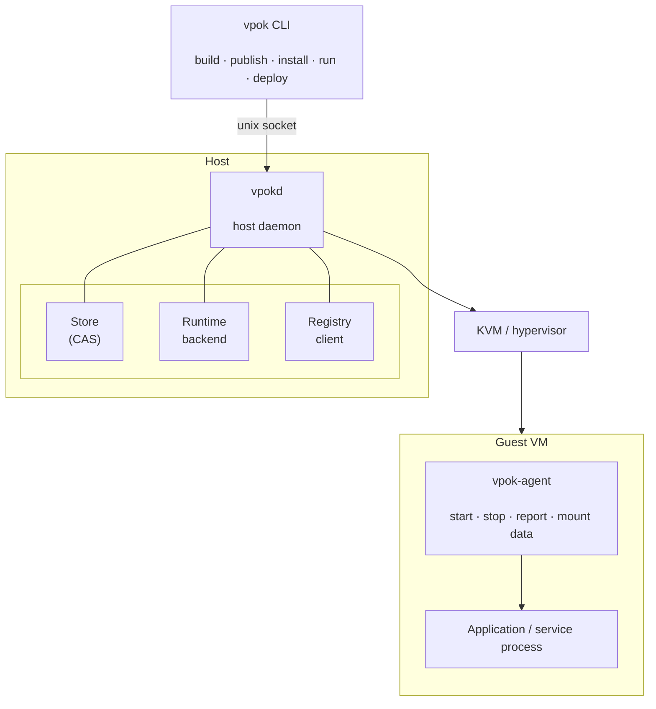

# VPOK Architecture

VPOK (Virtual Package Orchestration Kit) is a packaging and deployment system for isolated workloads. A VPOK package bundles an application or service together with the operating system environment it needs, and runs it inside a dedicated virtual machine.

## 1. Goals

- Package applications and services as self-contained VM images.
- Provide hardware-level isolation between workloads and the host.
- Make builds reproducible and artifacts content-addressed.
- Separate publisher intent (requirements) from operator policy (permissions).
- Function fully offline. The registry is a distribution channel, not a runtime dependency.
- Keep the privileged attack surface as small as possible.

## 2. Non-goals for v1

- Multi-host scheduling and cluster orchestration.
- Live migration of running workloads.
- GPU passthrough.
- Non-Linux guests (Windows, macOS).
- A graphical package manager.

These are deliberate omissions, not oversights. The v1 target is a single Linux host running many isolated workloads reliably.

## 3. System components



### vpok

User-facing CLI. Unprivileged. Talks to `vpokd` over a unix socket. Does not touch the hypervisor directly.

### vpokd

Host daemon. Owns the local store, the runtime backend, and the registry client. This is the only privileged component on the host. It should be small, auditable, and do nothing beyond what the CLI requests.

### vpok-agent

Runs inside the guest. Responsibilities:

- Start the entrypoint process.
- Forward stdout and stderr.
- Report health and exit status.
- Mount declared data volumes.
- Handle orderly shutdown.

It must not expose a general-purpose shell or unrestricted file access. Its protocol is narrow and versioned.

### Registry

Remote distribution. Serves content-addressed blobs and signed manifests. Supports resumable uploads and downloads.

### Store

Local content-addressed cache. Deduplicates blobs across packages. Supports garbage collection and offline operation.

### Runtime backend

Abstracts the hypervisor. The v1 target is KVM with a minimal device model. Later backends may include Firecracker or Cloud Hypervisor.

## 4. Package model

A VPOK package consists of:

- A **manifest** — signed, canonical, content-addressed.
- One or more **layers** — filesystem blobs addressed by SHA-256.
- An embedded **build spec** — for reproducibility and auditing.
- Optional **SBOM** and additional **signatures**.

The manifest is addressed by the digest of its canonical serialization. Layers are addressed by the digest of their contents. Nothing is referenced by name alone; a name resolves to a digest, and the digest is what the runtime verifies.

A package runs **one entrypoint in one VM**. Multi-process services are composed by running multiple packages and connecting them via declared network policy. This keeps the isolation model simple: one workload, one VM.

## 5. Lifecycle

```
build → sign → publish → install → deploy → run → update
```

1. **Build** — `vpok build` reads `vpok.build.toml`, produces layers and a manifest.
2. **Sign** — the publisher signs the manifest.
3. **Publish** — `vpok publish` uploads blobs and the manifest.
4. **Install** — `vpok install` fetches and verifies a package into the local store.
5. **Deploy** — `vpok deploy` reads `vpok.deploy.toml`, validates it against the package's declared requirements, and registers a deployment.
6. **Run** — `vpok run` starts the VM and the entrypoint.
7. **Update** — `vpok update` fetches a newer version, validates the deploy spec against it, and rolls forward or rolls back.

## 6. Isolation model

Every workload runs in its own VM. There is no shared kernel between workloads or between a workload and the host.

The guest is configured with:

- A read-only root filesystem (the package layers).
- One or more writable volumes mounted at declared paths.
- No network by default.
- No host filesystem access by default.
- No devices by default.
- Enforced CPU, memory, PID, and disk limits.

The host side enforces these through the hypervisor's device model. Host directory sharing, when granted, is implemented by a narrow virtio-fs mount, not by exposing the host filesystem.

## 7. Trust model

Three parties: **publisher**, **operator**, and **platform**.

- The publisher trusts the platform to distribute artifacts without tampering.
- The operator trusts the publisher only as far as the declared requirements and the granted permissions allow.
- The platform trusts neither party and provides verification primitives: signatures, digests, SBOMs, and permission   manifests.

The security claim is not "this package is safe." The claim is "this package can only do what the operator granted, and the operator can see exactly what was granted."

## 8. Configuration files

VPOK defines two configuration files:

| File                   | Author    | Purpose                          |
|------------------------|-----------|----------------------------------|
| `vpok.build.toml`      | Publisher | How to build the package image.  |
| `vpok.deploy.toml`     | Operator  | How to run the package on a host.|

Both files use TOML. Both carry an `apiVersion` field.

See `build-spec.md` and `deploy-spec.md` for the schemas.

The signed manifest is emitted as **canonical JSON** (RFC 8785), regardless of the authoring format. TOML is parsed into structured data, converted to canonical JSON, hashed, and signed. This keeps signatures deterministic and verification portable.

## 9. Extensibility

The manifest and both configuration files carry an `apiVersion` field. Unknown fields in a known version are rejected. New behavior is introduced by incrementing the version. This keeps old runtimes from silently misinterpreting new packages.
