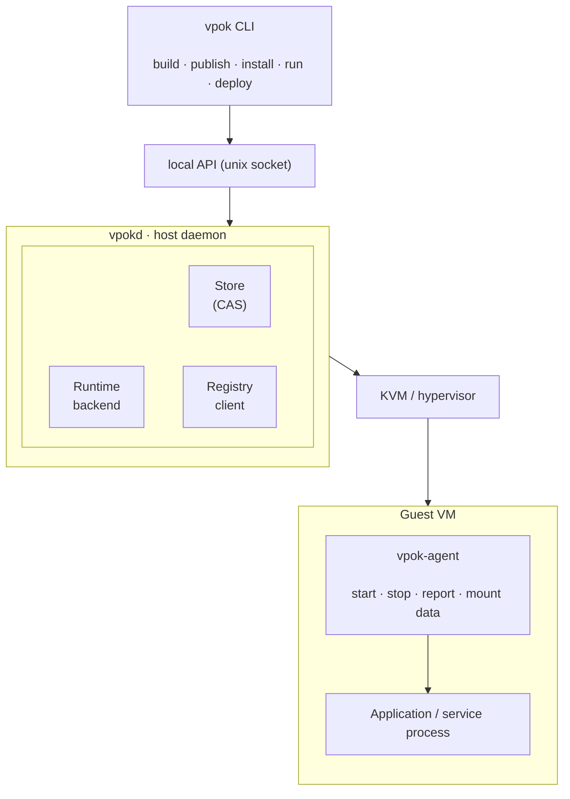

# VPOK Architecture

VPOK is a packaging and deployment system for isolated workloads. A VPOK package bundles an application or service together with the operating system environment it needs, and runs it inside a dedicated virtual machine.

## Goals

- Package applications and services as self-contained VM images.
- Provide hardware-level isolation between workloads and the host
- Make builds reproducible and artifacts content-addressed.
- Separate publisher intent (requirements) from operator policy (permissions).
- Function fully offline. The registry is a distribution channel, not a runtime dependency.
- Keep the priviledged attack surface as small as possible.

## 2. Non-goals for v1

- Multi-host scheduling and cluster orchestration.
- Live migration of running workloads.
- GPU passthrough.
- Non-Linux guests (Windows, macOS).
- A graphical package manager.

## System componenets

